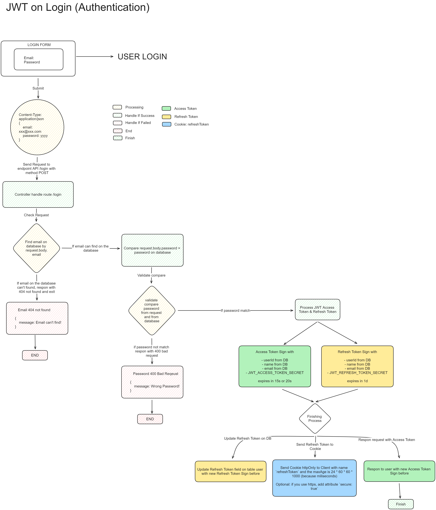

# Express & JWT & React.js

This repository is for exercise implement Express.js RESTful API with JWT Authentication and Authorization, then consume the RESTful API in the Frontend with React.js

# JWT on Login (Authentication)

# JWT on Middleware (Authorization)

