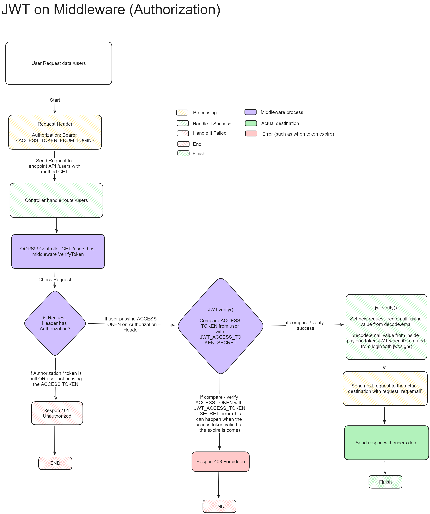

# Express & JWT & React.js

This repository is for exercise implement Express.js RESTful API with JWT Authentication and Authorization, then consume the RESTful API in the Frontend with React.js

# Table of Contents

-   [Running on Localhost](#running-on-localhost)
-   [JWT Flow](#jwt-flow)
    -   [JWT on Login (Authentication)](#jwt-on-login-authentication)
    -   [JWT on Middleware (Authorization)](#jwt-on-middleware-authorization)
    -   [JWT on Refresh Token](#jwt-on-refresh-token)
    -   [JWT on Logout](#jwt-on-logout)

# Running on Localhost

-   Clone this repository

```bash
git clone https://github.com/armandwipangestu/express-jwt-reactjs
```

<details>
<summary>Back End</summary>

-   Change current directory to backend

```bash
cd express-jwt-reactjs/backend
```

-   Install depedency library

```bash
yarn install && yarn global add nodemon
```

-   Create a new Database `express_jwt_reactjs`

```sql
CREATE DATABASE express_jwt_reactjs;
```

-   Copy `.env.example` to `.env`

> **NOTE**:
>
> Please edit this variable with your own configuration
>
> ```bash
> DB_NAME='express_jwt_reactjs'
> DB_USERNAME='root'
> DB_PASSWORD=''
> DB_HOSTNAME='localhost'
> DB_PORT=3306
> DB_PROVIDER='mysql'
> JWT_ACCESS_TOKEN_SECRET='<YOUR_RANDOM_STRING_FOR_JWT_ACCESS_TOKEN_SECRET>'
> JWT_REFRESH_TOKEN_SECRET='<YOUR_RANDOM_STRING_FOR_JWT_REFRESH_TOKEN_SECRET>'
> ```

```bash
cp .env.example .env
```

-   Running the Backend server

> **NOTE**:
>
> Backend server will run on `localhost:5000`

```bash
nodemon index
```

</details>

# JWT Flow

## JWT on Login (Authentication)


## JWT on Middleware (Authorization)



## JWT on Refresh Token


## JWT on Logout


